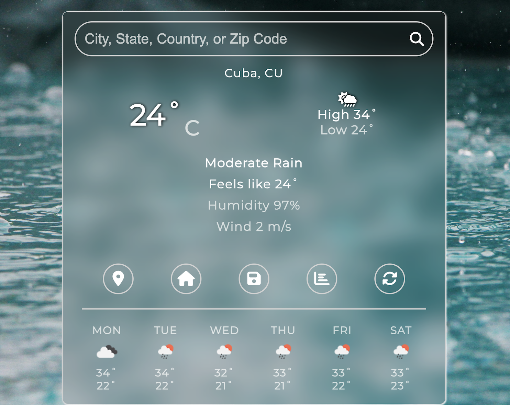

# Weather App

A modern, responsive weather application built with vanilla JavaScript, Express, and SCSS.
Users can search for weather by city or zip code, view current conditions, and see a 6-day forecast.
The backend securely proxies requests to the OpenWeatherMap API, keeping your API key safe.

# Preview



# Demo

https://weather-app-5hgp.onrender.com/

# Features

🌤️ Search weather by city name or zip code (supports Indian zip codes)
📍 Get weather for your current location
🏠 Save a home location for quick access
🌡️ Toggle between Celsius and Fahrenheit
📅 6-day weather forecast
⚡ Responsive, accessible, and mobile-friendly UI
🔒 API key is never exposed to the frontend

# Project Structure

```weather_app/
├── dist/
│   ├── index.html
│   ├── css/
│   │   └── main.css
│   ├── js/
│   │   ├── main.js
│   │   ├── dataFunctions.js
│   │   ├── domFunctions.js
│   │   └── currentLocation.js
│   ├── scss/
│   │   └── main.scss
│   └── img/
├── server.js
├── package.json
├── .env
└── README.md
```

# Getting Started

1. Clone the repository

- git clone https://github.com/yourusername/weather_app.git
- cd weather_app

2. Install dependencies

- npm install

3. Set up environment variables

- Create a `.env` file in the root directory
- Add your OpenWeatherMap API key:
  ```
  OPENWEATHER_API_KEY = your_api_key_here
  ```

4. Compile SCSS to CSS

- npm install -g sass
- sass --watch dist/scss/main.scss dist/css/main.css

5. Start the development server

- npm start
- The app will be available at http://localhost:3000.

# Extras 

- API Key: Keep your OpenWeatherMap API key safe in .env.
- Backend: All API requests are proxied through Express (server.js).

# Deployment

- Deploy the app using platforms like Heroku, Vercel, Render, etc.
- Sites like Netlify can host the static files only, but ensure the backend is hosted separately or use a serverless function to handle API requests.


